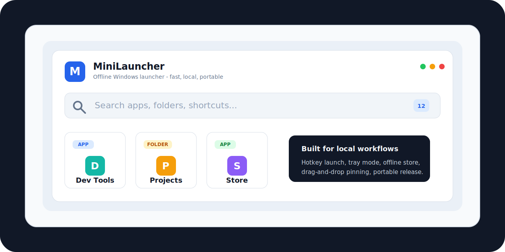

<p align="center">
  
</p>

<h1 align="center">MiniLauncher</h1>

<p align="center">
  A compact offline Windows app launcher built with WPF and .NET.
</p>

<p align="center">
  <a href="https://github.com/ts4m97/MiniLauncher/actions/workflows/dotnet.yml"></a>
  <a href="https://github.com/ts4m97/MiniLauncher/releases"></a>
  <a href="LICENSE"></a>
  
  
</p>

MiniLauncher is designed for local-first workflows: pinned apps, settings, store metadata, and usage history live on your machine without a cloud account or network dependency.

## Highlights

- Global hotkey: `Alt + Space`
- Search apps, folders, shortcuts, scripts, and custom keywords
- Pin by button or drag-and-drop
- Drag apps onto Offline Store to pin instantly
- Grid/list views with favorites and recent sorting
- Rename pins, edit keywords, change icons, and reorder items
- Offline Store powered by local `config.json`
- Tray mode, start with Windows, open near cursor
- Export/import config
- Portable self-contained `win-x64` publish

## Quick Start

```powershell
git clone https://github.com/ts4m97/MiniLauncher.git
cd MiniLauncher/MiniLauncher
dotnet run
```

## Build

```powershell
cd MiniLauncher
dotnet build
```

## Publish Portable Build

```powershell
cd MiniLauncher
dotnet publish -c Release -r win-x64 --self-contained true
```

Output:

```text
MiniLauncher/bin/Release/net9.0-windows/win-x64/publish/MiniLauncher.exe
```

## Configuration

User configuration is stored at:

```text
%AppData%\MiniLauncher\config.json
```

Settings can export/import this file for backup or migration.

## Offline Store

Set a local Store Path in Settings. The store folder can contain a root `config.json`:

```json
{
  "apps": [
    {
      "name": "Example Tool",
      "path": "Tools/ExampleTool.exe",
      "icon": "Icons/example.png",
      "category": "Tools",
      "keywords": "example utility"
    }
  ]
}
```

See [Offline Store docs](docs/OFFLINE_STORE.md) for more examples.

## Project Status

MiniLauncher is early but usable. See the [roadmap](docs/ROADMAP.md) for planned improvements.

## Releases And Packages

Download stable builds from [GitHub Releases](https://github.com/ts4m97/MiniLauncher/releases).

Tagged releases also publish a `MiniLauncher.Portable` package to [GitHub Packages](https://github.com/ts4m97/MiniLauncher/packages). See [RELEASING.md](docs/RELEASING.md) for the release process.

## Contributing

Contributions are welcome. Please read [CONTRIBUTING.md](CONTRIBUTING.md) before opening a pull request.

## License

MIT. See [LICENSE](LICENSE).
